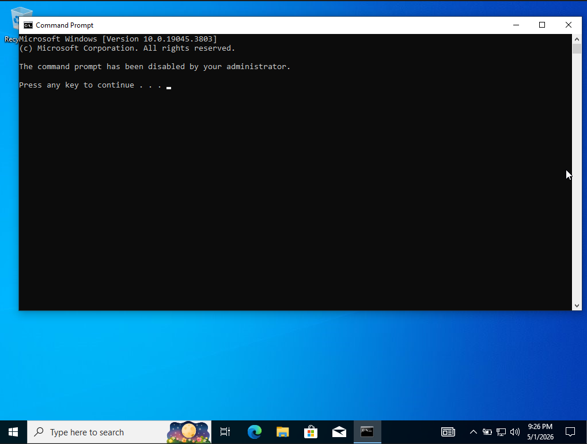
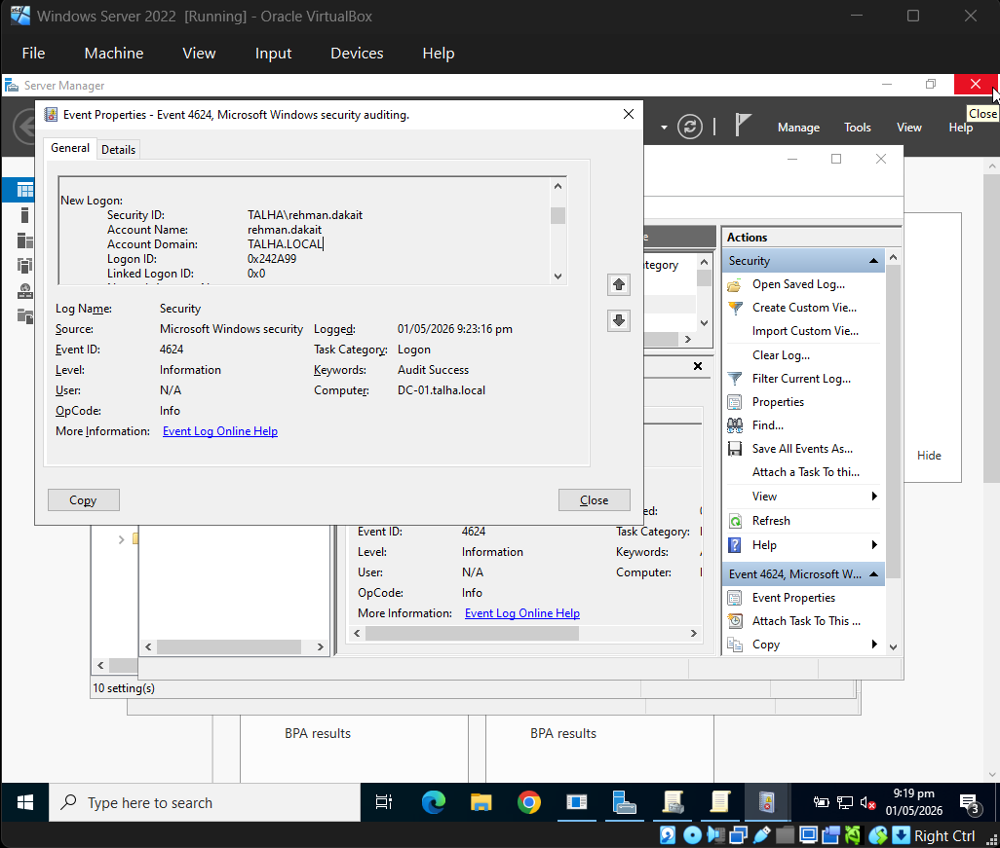

**Project Overview**

This project involved deploying a functional Windows Domain environment to practice centralized administration and identity management. The lab consists of a Windows Server 2022 Domain Controller and a Windows 10 Pro client workstation.

**Core Implementation**

**Active Directory Domain Services:** Established the talha.local domain and successfully joined the client workstation to the network.

**Organizational Structure:** Created an HR Organizational Unit (OU) to manage specific user sets and departmental assets.

**Identity & Access Management (IAM):** Configured and enforced a Group Policy Object (GPO) to restrict access to the Command Prompt for HR users, reducing the system's attack surface.

**Verification & Investigation**

**Policy Validation:** Verified the successful application of security policies on the client machine using gpupdate /force.

**Authentication Auditing:** Used Windows Event Viewer to audit login activity, identifying successful authentication events (Event ID 4624) to track user sessions and source IP addresses.

**Lab Evidence**

1. Policy Enforcement (Command Prompt Blocked)

2. Authentication Audit (Event Viewer Logs)

